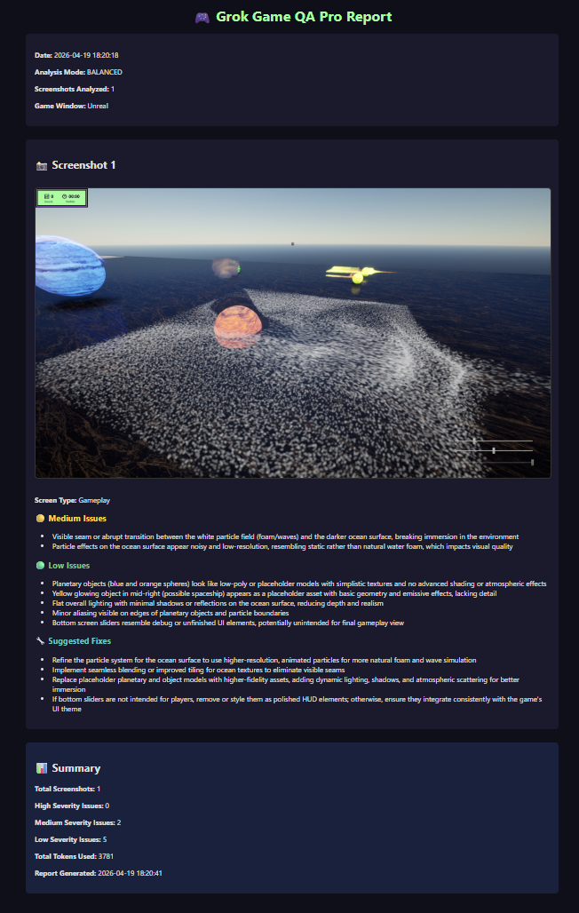

# 🎮 AutoGameVisionTester

An AI-powered automated QA tool that uses Grok-4 Vision to analyze game screenshots and generate professional HTML reports with actionable feedback.
Built for game developers who want fast, intelligent testing — especially useful for Unreal, Unity, and Godot projects.

## ✨ Features

- **AI-Powered Analysis** — Uses Grok-4 Vision to detect visual bugs, UI issues, lighting problems, LOD issues, and more
- **Professional HTML Reports** — Clean, readable reports with severity ratings (Critical / Medium / Low)
- **Smart Capture System** — Automatically skips duplicate frames using perceptual hashing (saves tokens)
- **History System** — View past reports with full severity tracking and one-click access
- **Multi-Engine Support** — Works with Unreal, Unity, Godot, and custom window titles
- **Three Analysis Modes** — Quick, Balanced, and Deep (for different needs)
- **Configurable Resolution** — Budget (960x540), Balanced (1280x720), or Full (1920x1080)

## 📸 Screenshots

**Example HTML Report:**



Clone the repository:
```bash
git clone https://github.com/Sqeakzz/AutoGameVisionTester.git
cd AutoGameVisionTester
```
Install dependencies:
```bash
pip install -r requirements.txt
```
Add your Grok API key in `config.json`:
```json
{
"grok_api_key": "your-api-key-here"
// ... other config options ...
}
```

## 🕹️ How to Use

Run the tool:
```bash
python main.py
```
Choose 1. Preview Mode:
- Play your game — the tool will automatically capture screenshots.
- Press Ctrl + Alt + S when ready to analyze.
- Choose analysis mode (quick, balanced, or deep).
- View the beautiful HTML report in your browser.

## 🔮 Future Plans (Phase 4)

- Full bug/issue database with tagging and search.
- Export reports to PDF.
- Automatic test case generation.
- Better analytics and trend tracking.
- Support for more game engines.

## 🛠️ Tech Stack
* Python 
* Grok-4 Vision API (xAI)
* Pillow + imagehash 
* Tkinter (status window)
* HTML reports with custom styling 

## 🤝 Contributing 
dPull requests are welcome! If you have ideas for new features or improvements, feel free to open an issue.